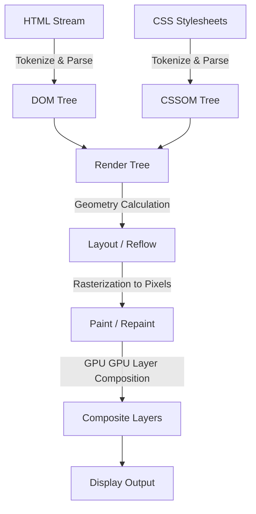
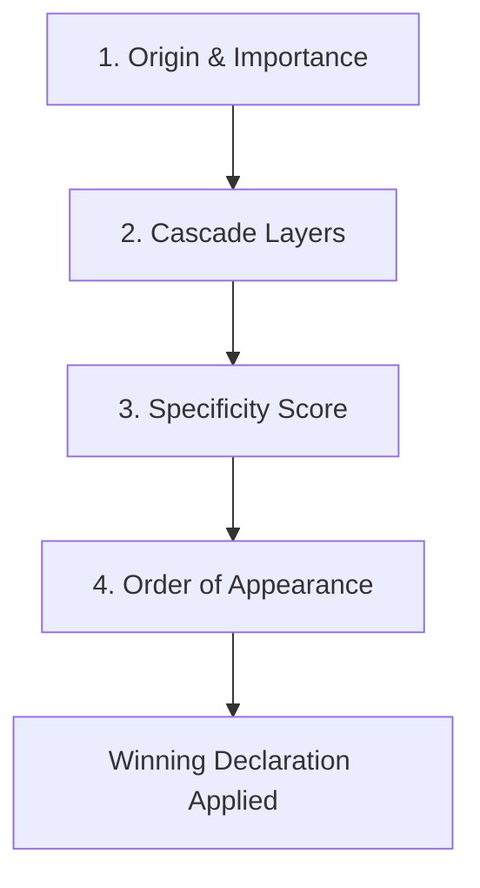

# Learn Modern CSS (Cascading Style Sheets)

<div align="center">


### The Definitive, Production-Grade Engineering Guide to Modern Cascading Style Sheets

[](https://github.com/manthanank/learn-css/actions/workflows/docker.yml)
[](https://github.com/manthanank/learn-css/actions/workflows/releases.yml)
[](LICENSE)
[](CONTRIBUTING.md)
[](https://www.typescriptlang.org/)
[](https://vitest.dev/)

</div>

---

## 📖 Executive Summary & Curriculum Scope

Cascading Style Sheets (CSS) has evolved from a simple document formatting language into a robust declarative programming environment capable of hardware-accelerated layouts, relational component queries, mathematical computations, and non-linear visual pipelines.

This repository serves as a master engineering reference manual and hands-on laboratory for Modern CSS. It encompasses:

- **Cascade Architecture & Specificity Resolution**: `@layer` priority topologies, origin ranking, and specificity calculation.
- **Modern Selector Engines**: Relational `:has()`, `:is()`, `:where()`, attribute matching, and native CSS nesting.
- **Hardware-Accelerated Layouts**: Multi-dimensional CSS Grid with Subgrid, dynamic Flexbox algorithms, and alignment contexts.
- **Responsive Architecture 2.0**: Component-level Container Queries (`@container`, `cqi`), modern media queries, and fluid typography via `clamp()`.
- **Next-Gen Color Systems**: Wide-gamut Display P3, perceptually uniform `oklch()`, `color-mix()`, and dynamic CSS custom property design systems.
- **Modern Motion & Physics**: Spring transitions, scroll-driven timelines, `@starting-style` entry hooks, and the View Transitions API.
- **Production Architecture & Performance**: Layout thrashing avoidance, `content-visibility`, Critical CSS, BEM vs semantic architectures, and containment.
- **Interactive Validator Engine**: Production TypeScript and Express 5 server featuring an algorithmic specificity calculator.
- **40 Senior Engineer Interview Questions**: Thorough answers covering real-world architecture, performance, and specification nuances.

---

## 📑 Table of Contents

1. [CSS Architecture, Parsing & The Cascade Pipeline](#1-css-architecture-parsing--the-cascade-pipeline)
   - [How Browsers Render CSS (OM, Layout, Paint, Composite)](#how-browsers-render-css-om-layout-paint-composite)
   - [The Cascade Resolution Hierarchy](#the-cascade-resolution-hierarchy)
   - [Cascade Layers (`@layer`)](#cascade-layers-layer)
   - [Specificity Calculation & Algorithm](#specificity-calculation--algorithm)
   - [Inheritance, Initial, Unset, and Revert](#inheritance-initial-unset-and-revert)
   - [The Box Model & `box-sizing: border-box`](#the-box-model--box-sizing-border-box)
   - [Margin Collapsing & Formatting Contexts (BFC)](#margin-collapsing--formatting-contexts-bfc)
   - [Stacking Contexts & Z-Index Architecture](#stacking-contexts--z-index-architecture)
2. [Modern Selectors, Pseudo-Classes & Native Nesting](#2-modern-selectors-pseudo-classes--native-nesting)
   - [The Relational Pseudo-Class (`:has()`)](#the-relational-pseudo-class-has)
   - [Specificity Management: `:is()` vs `:where()`](#specificity-management-is-vs-where)
   - [Structural & Form Pseudo-Classes (`:nth-child`, `:focus-visible`, `:user-invalid`)](#structural--form-pseudo-classes)
   - [Pseudo-Elements (`::before`, `::after`, `::marker`, `::backdrop`)](#pseudo-elements)
   - [Native CSS Nesting Specification](#native-css-nesting-specification)
3. [Modern Layout Systems: Flexbox & CSS Grid](#3-modern-layout-systems-flexbox--css-grid)
   - [Flexbox Deep Dive: Axes, Sizing & Alignment](#flexbox-deep-dive-axes-sizing--alignment)
   - [CSS Grid Architecture: Tracks, Lines & Areas](#css-grid-architecture-tracks-lines--areas)
   - [Advanced Grid: `repeat()`, `minmax()`, `auto-fit` vs `auto-fill`](#advanced-grid)
   - [CSS Subgrid: Nested Track Alignment](#css-subgrid-nested-track-alignment)
   - [Multi-Column Layout](#multi-column-layout)
4. [Responsive Architecture 2.0 & Container Queries](#4-responsive-architecture-20--container-queries)
   - [Container Queries (`@container`, `inline-size`)](#container-queries-container-inline-size)
   - [Container Query Units (`cqw`, `cqh`, `cqi`, `cqb`)](#container-query-units)
   - [Modern Media Queries (`prefers-color-scheme`, `prefers-reduced-motion`)](#modern-media-queries)
   - [Fluid Typography & Mathematical Functions (`clamp()`, `min()`, `max()`, `calc()`)](#fluid-typography--mathematical-functions)
5. [Colors, Typography & Visual Effects](#5-colors-typography--visual-effects)
   - [Modern Color Spaces: `oklch()`, Display P3 & `color-mix()`](#modern-color-spaces-oklch-display-p3--color-mix)
   - [CSS Custom Properties & `@property` Typed Variables](#css-custom-properties--property-typed-variables)
   - [Glassmorphism, Backdrop Filters & Blend Modes](#glassmorphism-backdrop-filters--blend-modes)
   - [Box Shadows, Drop Shadows & Elevation Systems](#box-shadows-drop-shadows--elevation-systems)
6. [Motion, Transitions & Modern Animation](#6-motion-transitions--modern-animation)
   - [Transitions & Hardware-Accelerated Properties (`transform`, `opacity`)](#transitions--hardware-accelerated-properties)
   - [Keyframe Animations & Easing Functions](#keyframe-animations--easing-functions)
   - [Entry & Exit Animations with `@starting-style`](#entry--exit-animations-with-starting-style)
   - [Scroll-Driven Animations (`animation-timeline`)](#scroll-driven-animations-animation-timeline)
   - [View Transitions API Integration](#view-transitions-api-integration)
7. [CSS Architecture, Methodologies & Performance](#7-css-architecture-methodologies--performance)
   - [CSS Methodologies (BEM, ITCSS, Utility vs Semantic)](#css-methodologies)
   - [Critical CSS & Render-Blocking Optimization](#critical-css--render-blocking-optimization)
   - [`content-visibility` & Layout Performance](#content-visibility--layout-performance)
   - [Preventing Layout Shifts (CLS)](#preventing-layout-shifts-cls)
8. [Interactive Showcase Application & CLI Validator](#8-interactive-showcase-application--cli-validator)
9. [40 Senior Interview Questions & Answers](#9-40-senior-interview-questions--answers)
10. [Comprehensive Modern CSS Cheat Sheet](#10-comprehensive-modern-css-cheat-sheet)

---

## 1. CSS Architecture, Parsing & The Cascade Pipeline

### How Browsers Render CSS (OM, Layout, Paint, Composite)

When a browser processes an HTML document and associated stylesheets, it executes the critical rendering path:



1. **CSSOM Construction**: CSS is parsed into a tree data structure representing rules, selectors, and computed values. CSS is render-blocking: the browser halts DOM rendering until all linked synchronous stylesheets are fully fetched and parsed.
2. **Render Tree Generation**: Nodes from the DOM and CSSOM are combined. Elements with `display: none` are excluded from the Render Tree, while elements with `visibility: hidden` are retained because they impact layout geometry.
3. **Layout (Reflow)**: The browser calculates the exact geometric coordinates and bounding dimensions of each render object.
4. **Paint**: Visual attributes (colors, borders, shadows, backgrounds) are drawn onto bitmap surfaces.
5. **Composite**: Individual GPU surface layers are assembled in the correct visual order and sent to the screen. Modifying `transform` or `opacity` bypasses Layout and Paint, achieving 60/120fps performance on the compositor thread.

---

### The Cascade Resolution Hierarchy

When multiple conflicting declarations target the same DOM element, the browser resolves the winning rule using a deterministic multi-stage waterfall:



1. **Origin and Importance**:
   - Transition declarations (`transition`)
   - User-Agent `!important`
   - User `!important`
   - Author `!important`
   - Animation declarations (`@keyframes`)
   - Author regular declarations
   - User regular declarations
   - User-Agent defaults
2. **Cascade Layers (`@layer`)**: Unlayered author styles beat layered author styles. Within layers, order of definition dictates precedence.
3. **Specificity**: Higher numeric tuple `(IDs, Classes/Attributes/Pseudos, Elements)` wins.
4. **Order of Appearance**: If specificity is identical, the last declared rule wins.

---

### Cascade Layers (`@layer`)

Cascade Layers (`@layer`) provide native language-level management of stylesheet precedence without inflating selector specificity.

#### Defining and Ordering Layers

```css
/* Explicit declaration of priority: earlier layers have lower priority */
@layer reset, base, layout, components, utilities;

@layer reset {
  *, *::before, *::after {
    box-sizing: border-box;
    margin: 0;
  }
}

@layer base {
  body {
    font-family: system-ui, sans-serif;
    color: #1a1a1a;
  }
}

@layer components {
  /* Specificity: 0,1,0,0 (one ID) */
  #hero-btn {
    background-color: navy;
  }
}

@layer utilities {
  /* Specificity: 0,0,1,0 (one class) - WINS over #hero-btn because utilities layer is higher! */
  .bg-danger {
    background-color: crimson;
  }
}

/* Unlayered styles ALWAYS override layered styles, regardless of specificity */
button {
  border-radius: 8px;
}
```

> [!IMPORTANT]
> The order in which `@layer name, name;` is declared establishes the entire cascade order. An unlayered selector will override any layered selector, allowing third-party libraries placed in `@layer vendor;` to be customized painlessly without `!important`.

---

### Specificity Calculation & Algorithm

Specificity is calculated as a 3-part tuple `(A, B, C)` or 4-part `(Inline, A, B, C)`:

| Column | Category | Examples |
| :--- | :--- | :--- |
| **Inline** | `style="..."` attribute on the element | `<div style="color: red;">` |
| **A (IDs)** | ID selectors | `#header`, `#nav`, `#user-profile` |
| **B (Classes/Attributes/Pseudos)** | Class selectors, attribute selectors, pseudo-classes | `.btn`, `[type="text"]`, `:hover`, `:focus`, `:first-child` |
| **C (Elements/Pseudo-elements)** | Tag names, pseudo-elements | `div`, `span`, `p`, `::before`, `::after`, `::marker` |

#### Comparison Rules:
Tuples are compared from left to right. `1,0,0` beats `0,99,99`.

```css
/* Specificity breakdown */
p                          /* (0, 0, 1) */
.card p                    /* (0, 1, 1) */
.card p.lead               /* (0, 2, 1) */
#main .card p.lead         /* (1, 2, 1) */
#main .card p.lead:hover   /* (1, 3, 1) */
#main .card p.lead::before /* (1, 2, 2) */
```

---

### Inheritance, Initial, Unset, and Revert

- **`inherit`**: Forces the property to take the computed value of its parent element.
- **`initial`**: Resets the property to its initial specification default (e.g., `inline` for `display`, `transparent` for `background-color`).
- **`unset`**: Acts as `inherit` if the property naturally inherits (e.g. `color`, `font-family`); otherwise acts as `initial` (e.g. `border`, `padding`).
- **`revert`**: Rolls back the property to the cascade value it would have had in the user-agent or user origin (reverting author styling).
- **`revert-layer`**: Rolls back the property to the value defined in the previous cascade layer.

```css
.card {
  all: unset; /* Strips all browser and parent styling */
  all: revert; /* Reverts to browser default user-agent styles */
}
```

---

### The Box Model & `box-sizing: border-box`

Every element generates a rectangular box comprised of four concentric areas:

```
+---------------------------+
|          Margin           |
|  +---------------------+  |
|  |       Border        |  |
|  |  +---------------+  |  |
|  |  |    Padding    |  |  |
|  |  |  +---------+  |  |  |
|  |  |  | Content |  |  |  |
|  |  |  +---------+  |  |  |
|  |  +---------------+  |  |
|  +---------------------+  |
+---------------------------+
```

- **`content-box` (Default)**: `width` and `height` apply exclusively to the content box. Padding and borders add to the rendered box dimensions (`Rendered Width = width + padding + border`).
- **`border-box` (Standard Best Practice)**: `width` and `height` encompass content, padding, and border (`Rendered Width = width`).

```css
*, *::before, *::after {
  box-sizing: border-box;
}
```

---

### Margin Collapsing & Formatting Contexts (BFC)

Top and bottom margins of adjoining in-flow block-level boxes collapse into a single margin equal to the maximum of the adjacent margins.

#### Margin collapsing occurs between:
1. **Adjacent siblings**: Bottom margin of element A and top margin of element B.
2. **Parent and first/last child**: When there is no border, padding, or inline content separating them.
3. **Empty blocks**: An element with no height, padding, or content.

#### How to Prevent Margin Collapsing (Establishing a Block Formatting Context):
- Set `display: flow-root` (the modern, clean BFC generator).
- Set `overflow: hidden` or `overflow: auto`.
- Use `display: flex` or `display: grid` (margins never collapse between flex/grid items).

---

### Stacking Contexts & Z-Index Architecture

`z-index` only operates on positioned elements (`relative`, `absolute`, `fixed`, `sticky`) and flex/grid items. A higher `z-index` in a child cannot break out of a lower parent stacking context.

#### What creates a new Stacking Context?
1. Root element `<html>`.
2. Positioned elements (`relative`, `absolute`) with a non-`auto` `z-index`.
3. Elements with `position: fixed` or `position: sticky`.
4. Elements with `opacity` less than `1`.
5. Elements with `transform`, `filter`, `perspective`, `clip-path`, or `backdrop-filter` other than `none`.
6. Elements with `container-type` or `isolation: isolate`.

```css
.isolated-card {
  isolation: isolate; /* Creates a clean, isolated local stacking context */
  position: relative;
}
```

## 2. Modern Selectors, Pseudo-Classes & Native Nesting

### The Relational Pseudo-Class (`:has()`)

`:has()` is the W3C relational selector that enables styling parents, predecessors, or ancestors based on child state or subsequent siblings.

#### 1. Parent Styling Based on Child State
```css
/* Style form card with red border if it contains an invalid input */
.form-card:has(input:invalid) {
  border-color: oklch(0.65 0.25 25);
  box-shadow: 0 0 15px oklch(0.65 0.25 25 / 0.2);
}

/* Style an article differently when it contains a hero image */
article:has(figure.hero) {
  grid-column: span 2;
}
```

#### 2. Previous Sibling Selection
```css
/* Style an h2 that is immediately followed by a paragraph */
h2:has(+ p) {
  margin-bottom: 0.5rem;
}
```

#### 3. State-Driven Full-Page Theming
```css
/* Toggle site-wide dark mode when checkbox is checked without JavaScript */
html:has(#theme-switch:checked) {
  --color-bg: #121212;
  --color-text: #ffffff;
}
```

---

### Specificity Management: `:is()` vs `:where()`

Both `:is()` and `:where()` take a comma-separated selector list, but their specificity handling differs fundamentally:

- **`:is()`**: Takes the specificity of its **most specific argument**.
- **`:where()`**: Always contributes **(0, 0, 0)** specificity regardless of arguments.

```css
/* :is() specificity is (1, 0, 0) because #nav has an ID */
:is(header, footer, #nav) a {
  color: blue; /* Specificity: (1, 0, 1) */
}

/* :where() specificity is (0, 0, 1) - easily overridden by any basic utility class */
:where(header, footer, #nav) a {
  color: gray; /* Specificity: (0, 0, 1) - only the 'a' element contributes */
}

.custom-link {
  color: green; /* Specificity: (0, 1, 0) - effortlessly overrides the :where() rule! */
}
```

---

### Structural & Form Pseudo-Classes

#### Modern Focus Ring Handling (`:focus-visible`)
Unlike `:focus`, which triggers on both mouse clicks and keyboard focus, `:focus-visible` only triggers when the user interacts via keyboard or assistive technology:

```css
button:focus {
  outline: none; /* Avoid jarring outlines on mouse click */
}

button:focus-visible {
  outline: 2px solid var(--color-primary);
  outline-offset: 3px;
}
```

#### Modern Form Validation (`:user-invalid` vs `:invalid`)
`:invalid` matches as soon as the page loads if a field is empty and marked `required`, creating an aggressive user experience. `:user-invalid` only triggers **after** the user has interacted with and blurred the input.

```css
/* Only show errors after user attempt */
input:user-invalid {
  border-color: crimson;
  background-color: #fff0f0;
}
```

#### Advanced `:nth-child` with `of S`
Filter sibling matching using the modern `of selector` syntax:

```css
/* Target the 2nd visible item among active elements */
li:nth-child(2 of .active) {
  font-weight: bold;
  color: teal;
}
```

---

### Pseudo-Elements

- **`::before` & `::after`**: Generate inline or block decorative elements inside the target container. Requires `content: ""`.
- **`::marker`**: Targets the bullet point or numerical indicator of list items (`<li>` or `<summary>`).
- **`::backdrop`**: Targets the full-viewport backdrop behind `<dialog>` elements or elements in the Fullscreen API.
- **`::selection`**: Customizes highlighted text background and color.

```css
dialog::backdrop {
  background: rgba(0, 0, 0, 0.6);
  backdrop-filter: blur(8px);
}

li::marker {
  color: var(--color-primary);
  font-size: 1.2em;
}

::selection {
  background: var(--color-primary);
  color: #ffffff;
}
```

---

### Native CSS Nesting Specification

Modern browsers support native CSS nesting without requiring Sass, LESS, or PostCSS:

```css
.card {
  padding: 1.5rem;
  background-color: #ffffff;
  border-radius: 12px;

  /* Direct nested elements */
  h2 {
    font-size: 1.5rem;
    color: #111;
  }

  p {
    color: #555;
    line-height: 1.5;
  }

  /* Using the ampersand (&) for pseudo-classes and modifiers */
  &:hover {
    box-shadow: 0 10px 25px rgba(0, 0, 0, 0.1);
  }

  &.is-featured {
    border: 2px solid gold;
  }

  /* Media queries nested directly inside component */
  @media (max-width: 768px) {
    padding: 1rem;

    h2 {
      font-size: 1.2rem;
    }
  }
}
```

## 3. Modern Layout Systems: Flexbox & CSS Grid

### Flexbox Deep Dive: Axes, Sizing & Alignment

Flexbox is a 1-dimensional layout model optimized for distributing space and aligning items along either a row or column.

```
Main Axis (flex-direction: row)   ---->
+---------------------------------------------+
|  +--------+   +--------+   +-------------+  |  | Cross Axis
|  | Item 1 |   | Item 2 |   |   Item 3    |  |  v
|  +--------+   +--------+   +-------------+  |
+---------------------------------------------+
```

#### Container Properties:
- **`flex-direction`**: `row` (default), `row-reverse`, `column`, `column-reverse`. Defines the main axis.
- **`justify-content`**: Aligns items along the main axis (`flex-start`, `flex-end`, `center`, `space-between`, `space-around`, `space-evenly`).
- **`align-items`**: Aligns items across the cross axis (`stretch`, `flex-start`, `flex-end`, `center`, `baseline`).
- **`flex-wrap`**: `nowrap` (default), `wrap`, `wrap-reverse`.
- **`gap`**: Replaces margin hacks by introducing uniform spacing between flex items.

#### Item Properties:
- **`flex-grow`**: Factor determining how much remaining free space the item should absorb (default `0`).
- **`flex-shrink`**: Factor determining how aggressively the item shrinks when space is constrained (default `1`).
- **`flex-basis`**: Initial size of the item before remaining space is distributed (default `auto`).
- **Shorthand `flex`**: `flex: 1` resolves to `flex: 1 1 0%`. `flex: auto` resolves to `flex: 1 1 auto`.

```css
.cluster-nav {
  display: flex;
  flex-wrap: wrap;
  align-items: center;
  justify-content: space-between;
  gap: 1rem;
}

.cluster-nav .search-bar {
  flex: 1 1 280px; /* Grow to fill space, shrink if needed, min basis 280px */
}
```

---

### CSS Grid Architecture: Tracks, Lines & Areas

CSS Grid is a 2-dimensional layout engine capable of controlling both rows and columns simultaneously.

#### 1. Explicit Tracks & Fractional Units (`fr`)
The `fr` unit represents a fraction of the remaining free space in the grid container.

```css
.dashboard-grid {
  display: grid;
  grid-template-columns: 240px 1fr 300px;
  grid-template-rows: auto 1fr auto;
  min-height: 100vh;
  gap: 1.5rem;
}
```

#### 2. Visual ASCII Layout with `grid-template-areas`
`grid-template-areas` allows intuitive declarative template design:

```css
.page-layout {
  display: grid;
  grid-template-areas:
    "header  header"
    "sidebar content"
    "footer  footer";
  grid-template-columns: 260px 1fr;
  grid-template-rows: 70px 1fr 60px;
  min-height: 100vh;
}

.site-header  { grid-area: header; }
.site-sidebar { grid-area: sidebar; }
.site-content { grid-area: content; }
.site-footer  { grid-area: footer; }
```

---

### Advanced Grid: `repeat()`, `minmax()`, `auto-fit` vs `auto-fill`

The ultimate responsive grid layout requiring **zero media queries**:

```css
.card-grid {
  display: grid;
  grid-template-columns: repeat(auto-fit, minmax(min(100%, 300px), 1fr));
  gap: 1.5rem;
}
```

#### `auto-fill` vs `auto-fit`:
- **`auto-fill`**: Fills the row with as many column tracks as will fit, creating empty tracks if available space exceeds the items.
- **`auto-fit`**: Fills the row with tracks, but collapses any empty tracks to `0px`, allowing existing items to expand and stretch across the remaining space.

---

### CSS Subgrid: Nested Track Alignment

Historically, grid children could not align their grandchildren with the outer parent grid. **CSS Subgrid** (`grid-template-rows: subgrid` or `grid-template-columns: subgrid`) shares track sizing directly with nested components.

#### Aligning Card Headers, Bodies, and Footers Across Independent Cards:

```css
.cards-container {
  display: grid;
  grid-template-columns: repeat(auto-fit, minmax(280px, 1fr));
  grid-template-rows: auto auto auto;
  gap: 1.5rem;
}

.card {
  display: grid;
  /* Span 3 parent grid rows and inherit row sizing from the parent container */
  grid-row: span 3;
  grid-template-rows: subgrid;
  background: white;
  padding: 1.5rem;
  border-radius: 12px;
}

/* Now, all card headers, text bodies, and footers line up perfectly horizontally! */
.card-header { font-size: 1.25rem; }
.card-body { color: #666; }
.card-footer { margin-top: auto; }
```

---

### Multi-Column Layout

For continuous text flow across editorial columns:

```css
.newspaper-article {
  column-count: 3;
  column-gap: 2rem;
  column-rule: 1px solid #e0e0e0;
}

.full-width-quote {
  column-span: all; /* Spans across all newspaper columns */
  margin-block: 2rem;
  font-size: 1.5rem;
  text-align: center;
}
```

## 4. Responsive Architecture 2.0 & Container Queries

### Container Queries (`@container`, `inline-size`)

Traditional Media Queries (`@media`) evaluate the entire browser viewport width. While functional for macroscopic page layouts, they fail when building modular component design systems: a card placed in a narrow sidebar needs a stacked layout, while the exact same card in a wide main section needs a horizontal layout.

**Container Queries** allow components to query the dimensions of their ancestor container.

```css
/* 1. Designate the parent element as a containment context */
.card-wrapper {
  container-type: inline-size;
  container-name: product-card;
}

/* 2. Default styles for small containers */
.product {
  display: flex;
  flex-direction: column;
  gap: 1rem;
}

.product-image {
  width: 100%;
  aspect-ratio: 16 / 9;
  object-fit: cover;
}

/* 3. Query the container size directly */
@container product-card (min-width: 480px) {
  .product {
    flex-direction: row;
    align-items: center;
  }

  .product-image {
    width: 180px;
    aspect-ratio: 1;
  }
}
```

---

### Container Query Units

Container Query units scale dynamically relative to the dimensions of the nearest container query ancestor:

| Unit | Description |
| :--- | :--- |
| **`cqw`** | 1% of the query container's width |
| **`cqh`** | 1% of the query container's height |
| **`cqi`** | 1% of the query container's inline size (width in horizontal writing modes) |
| **`cqb`** | 1% of the query container's block size (height in horizontal writing modes) |
| **`cqmin`** | Smaller value of `cqi` or `cqb` |
| **`cqmax`** | Larger value of `cqi` or `cqb` |

```css
.card-title {
  /* Scales typography seamlessly with the container's inline size */
  font-size: clamp(1rem, 5cqi + 0.5rem, 2rem);
}
```

---

### Modern Media Queries

#### 1. Range Syntax (Media Queries Level 4)
Replace cumbersome `min-width` / `max-width` with standard mathematical comparison operators:

```css
/* Legacy */
@media (min-width: 600px) and (max-width: 1024px) { ... }

/* Modern Range Syntax */
@media (600px <= width <= 1024px) {
  .sidebar { display: block; }
}

@media (width >= 1200px) {
  .container { max-width: 1140px; }
}
```

#### 2. User Preference Queries
```css
/* Dark/Light mode detection */
@media (prefers-color-scheme: dark) {
  :root {
    --bg-primary: #121212;
    --text-primary: #f0f0f0;
  }
}

/* Accessibility: Reduce Motion */
@media (prefers-reduced-motion: reduce) {
  *, *::before, *::after {
    animation-duration: 0.01ms !important;
    animation-iteration-count: 1 !important;
    transition-duration: 0.01ms !important;
    scroll-behavior: auto !important;
  }
}

/* High Contrast Mode */
@media (prefers-contrast: more) {
  button {
    border: 2px solid currentColor;
  }
}

/* Pointer & Hover Capabilities (Touch vs Mouse) */
@media (hover: hover) and (pointer: fine) {
  /* Mouse/Trackpad users: enable subtle hover micro-interactions */
  .interactive-card:hover {
    transform: translateY(-4px);
  }
}
```

---

### Fluid Typography & Mathematical Functions

By combining viewport units with `clamp()`, typography and spacing scale continuously without step-based breakpoint jumps.

#### Syntax of `clamp()`:
```css
font-size: clamp(MIN, VAL, MAX);
```
- **MIN**: Lower bound floor.
- **VAL**: Preferred dynamic value (e.g. `2vw + 1rem`).
- **MAX**: Upper bound ceiling.

```css
:root {
  /* Fluid typography from 16px (1rem) on mobile to 24px (1.5rem) on 4K desktop */
  --font-base: clamp(1rem, 0.8rem + 1vw, 1.5rem);
  
  /* Fluid hero heading: 32px to 64px */
  --font-hero: clamp(2rem, 1.2rem + 4vw, 4rem);

  /* Fluid padding */
  --spacing-gutter: clamp(1rem, 4vw, 3.5rem);
}

h1 {
  font-size: var(--font-hero);
  line-height: 1.1;
}

body {
  font-size: var(--font-base);
  padding-inline: var(--spacing-gutter);
}
```

## 5. Colors, Typography & Visual Effects

### Modern Color Spaces: `oklch()`, Display P3 & `color-mix()`

Legacy CSS relied on sRGB color models (`hex`, `rgb()`, `hsl()`). Modern CSS introduces wide-gamut colors and perceptually uniform spaces:

```mermaid
graph LR
    sRGB[sRGB (Classic Web: ~35% Visible)] --> DCI_P3[Display P3 (Apple Screens: ~45% Visible)]
    DCI_P3 --> Rec2020[Rec. 2020 (Ultra HD)]
    Rec2020 --> OKLCH[OKLCH Color Space (Perceptually Uniform)]
```

#### 1. Why OKLCH Wins Over HSL:
In HSL, colors with identical lightness (e.g. `hsl(60, 100%, 50%)` yellow vs `hsl(240, 100%, 50%)` blue) have vastly different perceived brightness to the human eye. In **OKLCH**:
- **L (Lightness)**: $0$ (pure black) to $1$ or $100\%$ (pure white). A lightness of $0.7$ looks identically bright regardless of hue!
- **C (Chroma)**: Purity/saturation of color ($0$ to $pprox 0.4$).
- **H (Hue)**: Angle from $0^{\circ}$ to $360^{\circ}$ across the color wheel.

```css
:root {
  /* Vibrant, wide-gamut purple */
  --brand-primary: oklch(0.62 0.24 290);
  --brand-primary-hover: oklch(0.70 0.26 290);
  
  /* Accessible dark theme surface */
  --bg-surface: oklch(0.18 0.03 260);
}
```

#### 2. Native Color Blending with `color-mix()`:
Dynamically mix two colors in a specified color space without preprocessors:

```css
.badge-subtle {
  /* Mix 20% primary brand color with 80% transparent in OKLCH space */
  background-color: color-mix(in oklch, var(--brand-primary) 20%, transparent);
  color: var(--brand-primary);
  border: 1px solid color-mix(in oklch, var(--brand-primary) 40%, transparent);
}
```

---

### CSS Custom Properties & `@property` Typed Variables

While standard CSS variables (`--val: #fff`) are untyped strings that cannot be smoothly animated or interpolated in keyframes, the `@property` rule provides strict type checking, inheritance control, and animation capabilities.

```css
/* Register typed CSS custom property */
@property --gradient-angle {
  syntax: "<angle>";
  inherits: false;
  initial-value: 0deg;
}

.rotating-border-card {
  --gradient-angle: 0deg;
  background: conic-gradient(
    from var(--gradient-angle),
    #ff0080,
    #7928ca,
    #0070f3,
    #ff0080
  );
  animation: rotateGradient 4s linear infinite;
}

@keyframes rotateGradient {
  to {
    --gradient-angle: 360deg; /* Smoothly interpolated by the browser! */
  }
}
```

---

### Glassmorphism, Backdrop Filters & Blend Modes

Modern frosted glass and refractive surfaces combine `backdrop-filter`, alpha transparency, and subtle borders.

```css
.glass-panel {
  background: oklch(1 0 0 / 0.12); /* Semi-transparent surface */
  backdrop-filter: blur(16px) saturate(180%);
  -webkit-backdrop-filter: blur(16px) saturate(180%);
  border: 1px solid oklch(1 0 0 / 0.2);
  border-radius: 16px;
  box-shadow: 0 20px 40px oklch(0 0 0 / 0.25);
}
```

#### Difference Blend Modes
```css
.hero-title {
  mix-blend-mode: difference;
  color: #ffffff; /* Inverts color over light backgrounds automatically */
}
```

---

### Box Shadows, Drop Shadows & Elevation Systems

Realistic lighting uses multi-layered ambient and directional shadows rather than harsh single-layer drop shadows:

```css
:root {
  /* High-fidelity 4-layer elevation shadow */
  --elevation-high: 
    0 1px 2px oklch(0 0 0 / 0.05),
    0 4px 8px oklch(0 0 0 / 0.05),
    0 12px 24px oklch(0 0 0 / 0.08),
    0 24px 48px oklch(0 0 0 / 0.12);
}

.modal-dialog {
  box-shadow: var(--elevation-high);
}

/* filter: drop-shadow applies around transparent PNGs and SVGs! */
.brand-logo-icon {
  filter: drop-shadow(0 4px 12px oklch(0.65 0.25 260 / 0.4));
}
```

## 6. Motion, Transitions & Modern Animation

### Transitions & Hardware-Accelerated Properties

To guarantee 60fps and 120fps smooth animations, only animate properties that execute on the compositor thread without triggering **Layout (Reflow)** or **Paint**:

| Operation | Triggered By | Performance Cost |
| :--- | :--- | :--- |
| **Layout / Reflow** | `width`, `height`, `top`, `left`, `margin`, `padding`, `display` | 🔴 Very Expensive (Entire DOM repositioned) |
| **Paint / Repaint** | `background-color`, `color`, `border-color`, `box-shadow` | 🟡 Moderate (Rasterized on CPU) |
| **Compositing** | `transform`, `opacity`, `filter` | 🟢 Instant (Hardware accelerated on GPU) |

```css
/* Performant interactive button */
.btn-action {
  transition: transform 0.25s cubic-bezier(0.2, 0.8, 0.2, 1),
              opacity 0.25s ease;
  will-change: transform; /* Signals GPU layer promotion */
}

.btn-action:hover {
  transform: translateY(-2px) scale(1.02);
}

.btn-action:active {
  transform: translateY(1px) scale(0.98);
}
```

---

### Keyframe Animations & Easing Functions

```css
@keyframes pulseGlow {
  0%, 100% {
    transform: scale(1);
    box-shadow: 0 0 0 0 oklch(0.65 0.22 260 / 0.7);
  }
  50% {
    transform: scale(1.05);
    box-shadow: 0 0 0 12px oklch(0.65 0.22 260 / 0);
  }
}

.status-indicator {
  animation: pulseGlow 2.5s infinite ease-in-out;
}
```

---

### Entry & Exit Animations with `@starting-style`

Historically, animating elements transitioning from `display: none` to `display: block` (or `<dialog>` opening) was impossible without JavaScript timing hacks. Modern CSS introduces `@starting-style` and `transition-behavior: allow-discrete`:

```css
dialog {
  opacity: 0;
  transform: scale(0.85);
  transition: opacity 0.3s ease,
              transform 0.3s cubic-bezier(0.34, 1.56, 0.64, 1),
              overlay 0.3s allow-discrete,
              display 0.3s allow-discrete;

  /* State when opened */
  &[open] {
    opacity: 1;
    transform: scale(1);
  }

  /* Initial state when first added to the top layer */
  @starting-style {
    &[open] {
      opacity: 0;
      transform: scale(0.85);
    }
  }
}
```

---

### Scroll-Driven Animations (`animation-timeline`)

Declaratively bind animations to scroll containers without JavaScript event listeners or `requestAnimationFrame`:

#### 1. Page Scroll Reading Progress Bar:
```css
@keyframes growProgress {
  from { transform: scaleX(0); }
  to { transform: scaleX(1); }
}

.reading-progress-bar {
  position: fixed;
  top: 0;
  left: 0;
  width: 100%;
  height: 4px;
  background: var(--color-primary);
  transform-origin: left;
  
  /* Link animation to the root viewport scroll */
  animation: growProgress auto linear;
  animation-timeline: scroll();
}
```

#### 2. Element View Progress (`view()`):
```css
@keyframes revealOnScroll {
  from {
    opacity: 0;
    transform: translateY(60px);
  }
  to {
    opacity: 1;
    transform: translateY(0);
  }
}

.scroll-card {
  animation: revealOnScroll auto ease forwards;
  animation-timeline: view();
  animation-range: entry 10% cover 40%;
}
```

---

### View Transitions API Integration

Seamlessly animate DOM state updates and page navigations:

```css
/* Custom transition names */
.hero-image {
  view-transition-name: hero-banner;
}

/* Customize the cross-fade animation */
::view-transition-old(hero-banner) {
  animation: 300ms cubic-bezier(0.4, 0, 0.2, 1) both fade-out;
}

::view-transition-new(hero-banner) {
  animation: 300ms cubic-bezier(0.4, 0, 0.2, 1) both fade-in;
}
```

---

## 7. CSS Architecture, Methodologies & Performance

### CSS Methodologies

- **BEM (Block, Element, Modifier)**: Provides explicit naming clarity and prevents cascading leaks (`.card`, `.card__title`, `.card--highlighted`).
- **Cascade Layers (@layer)**: The modern native replacement for ITCSS (Inverted Triangle CSS), organizing `reset`, `tokens`, `components`, and `overrides` at the language level.
- **Utility-First vs Semantic**: Utility classes offer rapid assembly; semantic architecture with `@layer` provides long-term maintainability and cleaner HTML.

---

### `content-visibility` & Layout Performance

For long, complex documents with thousands of DOM nodes, `content-visibility: auto` skips rendering off-screen elements until the user scrolls near them:

```css
.feed-item {
  /* Skips layout and paint for off-screen items */
  content-visibility: auto;
  /* Reserves placeholder height to prevent scrollbar jumping */
  contain-intrinsic-size: auto 350px;
}
```

---

### Preventing Layout Shifts (CLS)

- **Explicit Aspect Ratios**: Always set `aspect-ratio` or `width` and `height` on media elements to allow the browser to allocate layout space before the asset loads.
  ```css
  img {
    aspect-ratio: 16 / 9;
    width: 100%;
    height: auto;
  }
  ```
- **Font Display**: Use `font-display: swap` combined with `size-adjust` to match fallback system fonts and eliminate FOIT (Flash of Invisible Text) and FOUT shifts.

## 8. Interactive Showcase Application & CLI Validator

This repository includes a production-ready demonstration app and validator engine located in `src/`.

### Running Locally:
```bash
# Clone the repository
git clone https://github.com/manthanank/learn-css.git
cd learn-css

# Install dependencies
npm install

# Start development server with live reload
npm run dev

# Run Vitest test suite
npm run test

# Build production bundle
npm run build
```

Open `http://localhost:3000` to view the live CSS showcase and use the interactive Specificity Calculator.

### REST Endpoints:
- `POST /api/specificity`: Computes the (A, B, C) specificity score for any given selector.
  ```json
  // Request
  { "selector": "nav.menu > ul#primary li:hover a" }
  // Response
  { "specificity": { "a": 1, "b": 2, "c": 3, "formatted": "0,1,2,3" } }
  ```
- `POST /api/validate-color`: Validates color strings across hex, rgb, hsl, and modern oklch formats.

---

## 9. 40 Senior Interview Questions & Answers

### Question 1: How does the CSS Cascade algorithm resolve conflicting styles?
**Answer**: The browser evaluates conflicts through four primary stages:
1. **Origin and Importance**: Transitions beat User-Agent `!important`, which beats Author `!important`, which beats Animations, which beat Normal Author styles, User styles, and User-Agent defaults.
2. **Cascade Layers (`@layer`)**: Unlayered styles win over layered styles. Within layers, the last defined layer wins.
3. **Specificity**: The rule with higher (ID, Class/Attr/Pseudo-class, Element) score wins.
4. **Source Order**: If all previous stages are tied, the last declared rule wins.

---

### Question 2: What are Cascade Layers (`@layer`) and what problem do they solve?
**Answer**: Cascade Layers allow developers to organize stylesheets into explicit priority buckets (e.g. `@layer reset, base, theme, components, utilities;`). Regardless of selector specificity, styles in a higher layer override styles in a lower layer. This eliminates specificity wars and the need for `!important` when overriding third-party design systems or utility classes.

---

### Question 3: How does `:has()` differ from other pseudo-classes?
**Answer**: `:has()` is a relational pseudo-class acting as a "parent selector". It tests whether an element has descendants or siblings matching a relative selector (e.g., `article:has(img)` or `h1:has(+ p)`). It enables parent and prior-sibling styling based on dynamic child states.

---

### Question 4: What is the specificity difference between `:is()` and `:where()`?
**Answer**: `:is(selectorList)` takes the specificity of the most specific selector in its list. In contrast, `:where(selectorList)` always has a specificity of `(0, 0, 0)`, making it ideal for base resets and design systems that should be easily overridden.

---

### Question 5: What is the difference between Container Queries and Media Queries?
**Answer**: Media Queries evaluate the global viewport or user-agent screen width. Container Queries (`@container`) evaluate the dimensions (such as `inline-size`) of the component's nearest declared container ancestor (`container-type: inline-size`). This makes components truly modular and self-responsive anywhere in a layout.

---

### Question 6: Explain `auto-fit` vs `auto-fill` in CSS Grid.
**Answer**: Both work inside `repeat()`. `auto-fill` creates as many tracks as possible across the grid container, even if the tracks are empty. `auto-fit` also creates tracks, but collapses any empty tracks down to `0px`, causing the remaining tracks containing items to expand and fill the available container width.

---

### Question 7: What is CSS Subgrid and why is it useful?
**Answer**: In standard CSS Grid, children of grid items create their own independent grid contexts. With Subgrid (`grid-template-rows: subgrid` or `grid-template-columns: subgrid`), child elements participate directly in the parent grid's tracks, allowing elements in different cards (e.g., titles, descriptions, buttons) to align horizontally across items.

---

### Question 8: Why is OKLCH preferred over HSL in modern design systems?
**Answer**: HSL is not perceptually uniform: yellow and blue with 50% lightness appear vastly different in perceived brightness to the human eye. OKLCH is perceptually uniform: lightness (L) is consistent across all hues, preventing contrast degradation and ensuring accessible color calculations. It also accesses the full wide-gamut P3 color space.

---

### Question 9: What creates a Stacking Context in CSS?
**Answer**: A Stacking Context is created by:
- The root document element (`<html>`).
- Elements with `position: relative` or `absolute` and a numerical `z-index`.
- Elements with `position: fixed` or `sticky`.
- Elements with `opacity < 1`.
- Elements with `transform`, `filter`, `perspective`, `clip-path`, or `backdrop-filter`.
- Elements with `isolation: isolate` or `container-type`.

---

### Question 10: How does `box-sizing: border-box` differ from `content-box`?
**Answer**: Under `content-box` (browser default), `width` and `height` only apply to the content. Adding padding or border expands the rendered element box. Under `border-box`, padding and borders are absorbed within the specified `width` and `height`, preventing unexpected layout overflows.

---

### Question 11: What is a Block Formatting Context (BFC) and how do you create one today?
**Answer**: A BFC is an isolated layout environment where block boxes are laid out vertically from the top and margins collapse only within the context. The modern, clean standard to create a BFC is `display: flow-root`. It contains internal floats and prevents margin collapsing with exterior elements.

---

### Question 12: What is the purpose of `@property` in CSS Houdini?
**Answer**: `@property` registers a typed CSS custom property. By defining `syntax` (e.g., `"<color>"` or `"<angle>"`), `inherits`, and `initial-value`, browsers understand how to interpolate the variable during CSS transitions and `@keyframes` animations.

---

### Question 13: How does `:focus-visible` improve user experience over `:focus`?
**Answer**: `:focus` triggers on every focus event, including mouse and touch clicks, which often leads developers to remove focus rings entirely. `:focus-visible` only displays the focus indicator when keyboard navigation or assistive devices are utilized, preserving accessibility while keeping mouse clicks clean.

---

### Question 14: What is `:user-invalid` and how does it differ from `:invalid`?
**Answer**: `:invalid` matches immediately upon page load if a required input is empty, causing premature error states. `:user-invalid` only matches after the user has actively interacted with the field and blurred it, following standard UX validation principles.

---

### Question 15: What are the three trees in browser rendering?
**Answer**:
1. **DOM Tree**: Structural hierarchy of parsed HTML tags.
2. **CSSOM Tree**: Style rules and computed styles mapped to selectors.
3. **Render Tree**: Intersection of DOM and CSSOM containing only visible elements (excluding `display: none` and `<head>`).

---

### Question 16: What is the difference between `display: none` and `visibility: hidden`?
**Answer**: `display: none` removes the element completely from the Render Tree, so it occupies no physical space in layout and triggers reflow. `visibility: hidden` hides the element visually, but retains its physical geometry in the layout (preventing reflow).

---

### Question 17: Which CSS properties are cheapest to animate and why?
**Answer**: `transform` and `opacity`. They can be calculated directly on the compositor thread via GPU layers without triggering expensive Layout (Reflow) or Paint (Repaint) cycles on the main CPU thread.

---

### Question 18: What is `@starting-style` in CSS?
**Answer**: `@starting-style` defines the initial pre-display state of an element when it transitions from `display: none` into the top layer (such as `<dialog>` or popovers), enabling pure CSS entry animations without JavaScript timeouts.

---

### Question 19: How do Scroll-Driven Animations work without JavaScript?
**Answer**: Using `animation-timeline: scroll()` or `animation-timeline: view()`, the browser directly binds animation progress (0% to 100%) to the scroll progress of a scroll container or the visibility range of an element within the viewport, executing off the main thread.

---

### Question 20: How does `clamp()` work for fluid typography?
**Answer**: `clamp(min, preferred, max)` restricts a value between an absolute minimum and maximum boundary while allowing a dynamic preferred value (such as `2vw + 1rem`) to scale smoothly with viewport or container dimensions.

---

### Question 21: What is the difference between `px`, `rem`, and `em`?
**Answer**:
- `px`: Absolute unit (1/96th of an inch).
- `rem`: Relative to the root element's (`<html>`) font size (typically 16px).
- `em`: Relative to the element's own font size (or parent's font size when defining font-size).

---

### Question 22: What is `margin: 0 auto` and why does it center block elements?
**Answer**: Setting left and right margins to `auto` instructs the formatting engine to divide all remaining horizontal space in the containing block equally between the left and right margins, centering the block element.

---

### Question 23: How do you vertically and horizontally center an element in CSS?
**Answer**:
```css
/* Flexbox */
.parent { display: flex; justify-content: center; align-items: center; }

/* Grid */
.parent { display: grid; place-items: center; }
```

---

### Question 24: What is `aspect-ratio` and how does it mitigate Cumulative Layout Shift (CLS)?
**Answer**: `aspect-ratio` reserves the proportional space for images, videos, and cards before the media has downloaded, preventing layout jumps and reflows when the asset finishes loading.

---

### Question 25: What is `color-mix()` in CSS Color Module Level 4?
**Answer**: A native function that blends two colors in a specified color space (e.g. `color-mix(in oklch, red 30%, blue)`), enabling dynamic tints, shades, and transparent variants directly in CSS without preprocessors.

---

### Question 26: What is the difference between `flex-basis: 0` and `flex-basis: auto`?
**Answer**: `flex-basis: auto` considers the item's content size before distributing remaining free space. `flex-basis: 0` ignores content size, distributing all container space proportionally according to `flex-grow` factors.

---

### Question 27: What is `contain: layout` or `content-visibility: auto`?
**Answer**: `content-visibility: auto` instructs the browser to skip layout and painting for elements currently off-screen. Coupled with `contain-intrinsic-size`, it delivers dramatic performance gains on long web pages.

---

### Question 28: What is the difference between `linear-gradient` and `conic-gradient`?
**Answer**: `linear-gradient` transitions colors along a straight directional line. `conic-gradient` transitions colors rotated around a central point, ideal for color wheels, pie charts, and rotating borders.

---

### Question 29: What is `isolation: isolate` used for?
**Answer**: It creates a new stacking context without requiring explicit positioning or `z-index` properties, preventing child elements with negative `z-index` from slipping behind background parents.

---

### Question 30: How does native CSS Nesting handle the ampersand (`&`)?
**Answer**: `&` explicitly references the parent selector. When writing pseudo-classes (`&:hover`), modifiers (`&.active`), or parent qualifiers (`.dark &`), `&` is required. When targeting bare element tags inside a selector (`h2`), modern browsers allow implicit nesting without `&`.

---

### Question 31: What is the difference between `inline`, `inline-block`, and `block`?
**Answer**:
- `inline`: Flows with text, ignores `width`, `height`, and vertical margins/paddings for layout bounds.
- `inline-block`: Flows inline with text but respects `width`, `height`, margins, and padding.
- `block`: Starts on a new line, expands to fill container width by default, and respects all box model dimensions.

---

### Question 32: What is the View Transitions API in CSS?
**Answer**: A browser API that snapshots old and new DOM states during navigation or state updates, allowing developers to create smooth cross-fades and morphing transitions using standard CSS pseudo-elements (`::view-transition-old` and `::view-transition-new`).

---

### Question 33: What is `backdrop-filter` and how does it differ from `filter`?
**Answer**: `filter` applies visual effects (like blur, grayscale, brightness) to the element itself and its children. `backdrop-filter` applies visual effects to all content rendered *behind* the element.

---

### Question 34: What is CSS BEM methodology?
**Answer**: Block Element Modifier (`.block__element--modifier`) is a naming convention that creates flat specificity, prevents style leaking, and documents component relationships directly in class names.

---

### Question 35: What is the difference between `gap` and `margin`?
**Answer**: `gap` applies spacing strictly between items inside flex or grid containers. Unlike `margin`, it never requires `:last-child` margin negation hacks and avoids margin collapsing issues.

---

### Question 36: What is `revert-layer`?
**Answer**: `revert-layer` rolls back a property value to the value calculated in the preceding cascade layer, allowing clean overrides in modular layer architectures.

---

### Question 37: How do you implement a CSS-only dark theme?
**Answer**: Use CSS custom properties combined with `@media (prefers-color-scheme: dark)`:
```css
:root { --bg: #fff; --text: #000; }
@media (prefers-color-scheme: dark) {
  :root { --bg: #121212; --text: #fff; }
}
body { background: var(--bg); color: var(--text); }
```

---

### Question 38: What is `position: sticky` and when does it fail to stick?
**Answer**: An element acts as `relative` until its container crosses a specified threshold (e.g. `top: 0`), where it acts as `fixed` within the bounds of its parent container. It fails if any ancestor has `overflow: hidden`, `overflow: auto`, or `overflow: scroll` that clips scrolling.

---

### Question 39: What is `will-change` and why should it be used sparingly?
**Answer**: `will-change` hints to the browser that a property will animate, prompting the browser to promote the element to a dedicated GPU layer ahead of time. Overusing it consumes excessive GPU memory and degrades rendering performance.

---

### Question 40: What is the difference between `auto-fit` and `auto-fill` with `minmax()`?
**Answer**: When there is excess horizontal space, `auto-fill` leaves empty grid tracks in the row, maintaining fixed column sizes. `auto-fit` collapses empty tracks to `0px` and stretches the existing items across the entire remaining width.

---

## 10. Comprehensive Modern CSS Cheat Sheet

```css
/* 1. Universal Modern Reset */
*, *::before, *::after {
  box-sizing: border-box;
  margin: 0;
  padding: 0;
}

/* 2. Responsive Card Grid without Media Queries */
.grid {
  display: grid;
  grid-template-columns: repeat(auto-fit, minmax(min(100%, 300px), 1fr));
  gap: 1.5rem;
}

/* 3. Centering Everything */
.center-box {
  display: grid;
  place-items: center;
}

/* 4. Fluid Typography with clamp() */
h1 {
  font-size: clamp(2rem, 1.5rem + 3vw, 4.5rem);
}

/* 5. Modern Container Queries */
.container {
  container-type: inline-size;
}
@container (min-width: 400px) {
  .item { flex-direction: row; }
}

/* 6. Relational :has() */
form:has(:invalid) button[type="submit"] {
  opacity: 0.5;
  pointer-events: none;
}

/* 7. Zero Specificity with :where() */
:where(h1, h2, h3) {
  font-weight: 700;
  line-height: 1.2;
}

/* 8. Glassmorphism */
.glass {
  background: oklch(1 0 0 / 0.15);
  backdrop-filter: blur(12px);
  border: 1px solid oklch(1 0 0 / 0.2);
}

/* 9. Scroll-Driven Reading Progress */
.progress {
  transform-origin: left;
  animation: scaleX auto linear;
  animation-timeline: scroll();
}
@keyframes scaleX {
  from { transform: scaleX(0); }
  to { transform: scaleX(1); }
}

/* 10. Smooth Entry Animation for Dialog */
dialog[open] {
  opacity: 1;
  transition: opacity 0.3s ease allow-discrete;
  @starting-style {
    opacity: 0;
  }
}
```

---

## 🤝 Contributing

Contributions, issues, and feature requests are welcome! Feel free to check the [issues page](https://github.com/manthanank/learn-css/issues) or read [CONTRIBUTING.md](CONTRIBUTING.md).

---

## 📜 License

Distributed under the ISC License. See [LICENSE](LICENSE) for more information.

---

## 👤 Author & Connect

**Manthan Ankolekar**

- **GitHub**: [@manthanank](https://github.com/manthanank)
- **LinkedIn**: [Manthan Ankolekar](https://www.linkedin.com/in/manthanank)
- **Twitter/X**: [@manthan_ank](https://twitter.com/manthan_ank)
- **YouTube**: [@manthanank](https://www.youtube.com/@manthanank)

---

## ☕ Support

If you found this master guide useful, please consider starring ⭐ the repository and supporting:

[](https://www.buymeacoffee.com/manthanank)
[](https://github.com/sponsors/manthanank)
